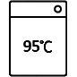
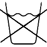
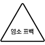
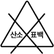
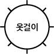
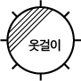

## Care Label Recognition

2021년 2학기 디자인적 사고 수업에서 만든 케어 라벨 인식 모델입니다.

케어 라벨 사진을 넣으면 사진 속 세탁 기호를 인식하여 분류하는 CNN 모델입니다.

[이 분](https://github.com/cpprhtn)과 [이 글](https://debuggercafe.com/multi-label-image-classification-with-pytorch-and-deep-learning/)의 큰 도움을 받았습니다.

현재 인식 가능한 기호는 아래와 같습니다.

  
  
  
  
  
  

